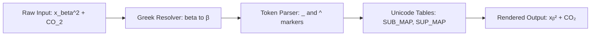
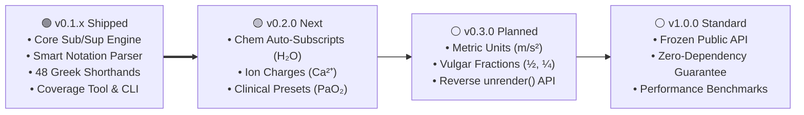

# uniscript

[](https://github.com/ahmadw13/uniscript/actions/workflows/ci.yml)
[](https://pypi.org/project/uniscript/)
[](https://www.python.org/)
[](https://opensource.org/licenses/MIT)

> Convert plain strings to Unicode subscript/superscript — no HTML, no LaTeX, no images. Just text.

```python
from uniscript import render

render("t_insp")       # → "tᵢₙₛₚ"
render("E=mc^2")       # → "E=mc²"
render("x^(n+1)")      # → "xⁿ⁺¹"
render(r"x_\beta")     # → "xᵦ"
render(r"\sigma_x")    # → "σₓ"
```

| Input Notation | Rendered Output | Domain |
| :--- | :--- | :--- |
| `render("t_insp")` | `tᵢₙₛₚ` | Physiology / Medicine |
| `render("CO_2")` | `CO₂` | Chemistry |
| `render("E=mc^2")` | `E=mc²` | Physics |
| `render("x^(n+1)")` | `xⁿ⁺¹` | Mathematics |
| `render(r"x_\beta")` | `xᵦ` | Greek Shorthands |
| `render(r"E_\gamma^2")` | `Eᵧ²` | Particle Physics |

### How It Works



---

## Installation

```bash
pip install uniscript
```

Or with [uv](https://github.com/astral-sh/uv):

```bash
uv add uniscript
```

---

## Usage

### `render(text)` — Auto-parse notation strings

Uses `_` for subscript and `^` for superscript, matching standard scientific and mathematical notation:

```python
from uniscript import render

# Subscripts
render("t_insp")     # tᵢₙₛₚ
render("V_O2_max")   # VO₂ₘₐₓ
render("H_2O")       # H₂O
render("CO_2")       # CO₂

# Superscripts & Grouping
render("x^2 + y^2")  # x² + y²
render("x^(n+1)")    # xⁿ⁺¹
render("1^st")       # 1ˢᵗ
```

### Greek Letter Shorthands

`render()` automatically recognizes LaTeX-style Greek names (`\alpha`, `\beta`, `\gamma`, etc.):

```python
render(r"x_\beta")     # xᵦ
render(r"x^\gamma")    # xᵞ
render(r"\sigma_x")    # σₓ
render(r"\rho_0")      # ρ₀
render(r"E_\gamma^2")  # Eᵧ²
```

All 48 Greek letters (24 lowercase and 24 uppercase) are supported as shorthands.

### Explicit Functions: `sub()` and `sup()`

```python
from uniscript import sub, sup

sub("insp")   # ᵢₙₛₚ
sub("0123")   # ₀₁₂₃
sub("(n+1)")  # ₍ₙ₊₁₎
sub("β")      # ᵦ

sup("2")      # ²
sup("n+1")    # ⁿ⁺¹
sup("th")     # ᵗʰ
sup("δ")      # ᵟ
```

### Fallback Behavior

Not every character has a Unicode subscript or superscript equivalent. You can customize the fallback behavior:

```python
from uniscript import sub, FallbackMode

# PASSTHROUGH (default): Leaves unsupported characters untouched
sub("q", fallback=FallbackMode.PASSTHROUGH)  # 'q'

# OMIT: Silently drops unsupported characters
sub("q", fallback=FallbackMode.OMIT)         # ''

# RAISE: Raises SubstitutionError with detailed Unicode code point info
sub("q", fallback=FallbackMode.RAISE)        # raises SubstitutionError
```

### Coverage & Inspection Tools

Check which characters are supported in plain text:

```python
from uniscript import coverage, check

# Get detailed breakdown and percentage
sub_report, sup_report = coverage()
print(sub_report)
# uniscript coverage — subscript
#   Supported  : 32/42 (76%)
#   Unsupported: 10/42
#   ...

# Audit individual characters in an expression
check("t_insp")
# {'t': {'sub': 'ₜ', 'sup': 'ᵗ'}, 'i': {'sub': 'ᵢ', 'sup': 'ⁱ'}, ...}
```

---

## Command-Line Interface (CLI)

`uniscript` includes a command-line tool with support for arguments and piped stdin:

```bash
# Direct argument parsing
uniscript "t_insp"
# tᵢₙₛₚ

# Piped stdin
echo "E=mc^2" | uniscript
# E=mc²

# Convert entire string to sub/superscript
uniscript --sub "insp"
uniscript --sup "2"

# Inspect character coverage in your terminal
uniscript --coverage
uniscript --coverage --chars lower
```

---

## Unicode Coverage Summary

| Character set | Subscript | Superscript |
|---|---|---|
| Digits `0–9` | Full (10/10) | Full (10/10) |
| Letters `a–z` | Partial (17/26: `ₐ ₑ ₕ ᵢ ⱼ ₖ ₗ ₘ ₙ ₒ ₚ ᵣ ₛ ₜ ᵤ ᵥ ₓ`) | Almost full (25/26) |
| Letters `A–Z` | None | Partial (~18) |
| Symbols `+ − = ( )` | Full | Full |
| Greek letters | Partial (`β γ ρ φ χ`) | Partial (`β γ δ θ ι φ χ`) |

---

## Roadmap



- [x] **v0.1.0 / v0.1.1** — Production release on PyPI with core parser, Greek shorthands, coverage tool, and CLI.
- [ ] **v0.2.0** — Automatic chemical formula recognition, ion charges, and physiological parameter presets.
- [ ] **v0.3.0** — Metric units, vulgar fractions, and `unrender()` reverse normalization.
- [ ] **v0.4.0** — Rich / Click / Typer CLI formatting integrations.
- [ ] **v1.0.0** — Frozen public API with zero-dependency guarantee.

---

## Development

See [DEVELOPMENT.md](DEVELOPMENT.md) for local environment setup, testing, and contribution flow.

---

## License

MIT

